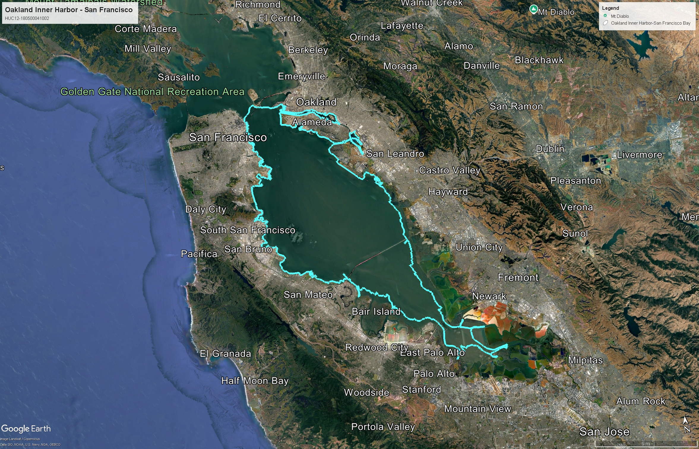
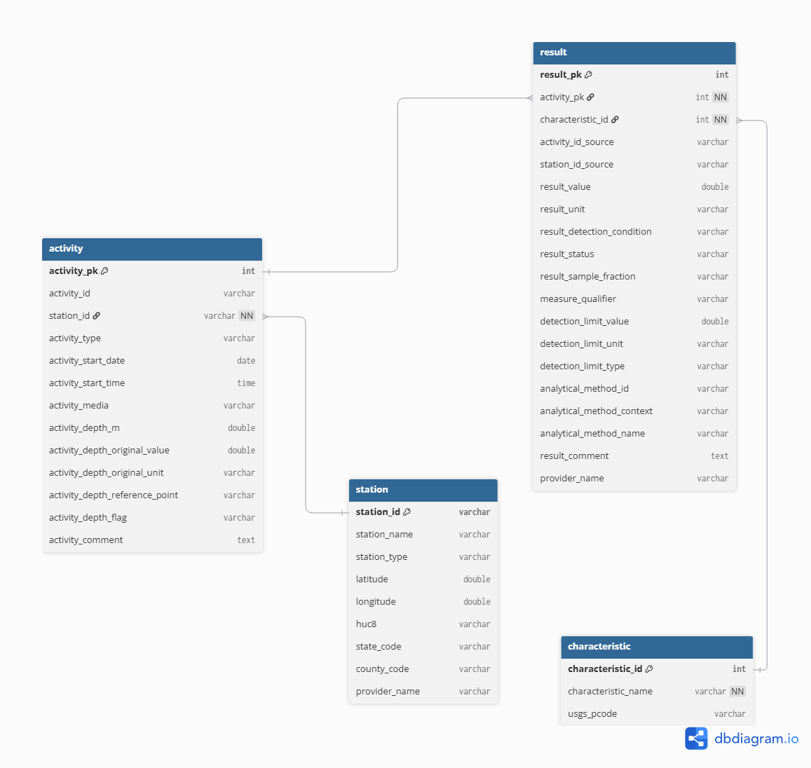

# San Francisco Inner Bay Water Quality Monitoring Database

A comprehensive project to build a relational database from EPA Water Quality Portal data, focusing on water quality measurements in a subwatershed of the San Francisco Bay region.

## Table of Contents

- [Project Overview](#project-overview)
- [Technical Stack](#technical-stack)
- [Data Source](#data-source)
- [Database Schema](#database-schema)
- [Project Structure](#project-structure)
- [Data Pipeline Workflow](#data-pipeline-workflow)
- [Installation & Requirements](#installation--requirements)
- [How to Use](#how-to-use)
- [Analysis & Visualization](#analysis--visualization)
- [Deliverables](#deliverables)
- [Key Outputs](#key-outputs)
- [References](#references)
- [License](#license)

## Project Overview



This project builds a relational database to analyze water quality measurements within a subwatershed of the San Francisco Bay region (HUC12: 180500041002). The goal is to organize environmental monitoring data into a structured format that enables efficient querying and analysis of water quality patterns.

The database is designed to reflect real-world data collection processes, linking monitoring locations (stations), sampling events (activities), and laboratory measurements (results). Using this structured approach, the project demonstrates the ability to clean real-world environmental data, design a relational database schema, and extract meaningful insights using SQL.

**Key Workflow:** Raw Data → Cleaning → Database Schema → Analysis & Visualization

## Technical Stack

- **Languages**: Python, SQL
- **Database**: DuckDB (in-process SQL OLAP database)
- **Data Processing**: pandas, numpy
- **Notebooks**: Jupyter Notebook
- **Visualization**: matplotlib, seaborn
- **Data Source**: Water Quality Portal (WaterQualityData.us)
- **Geographic Focus**: San Francisco Bay region (HUC12: 180500021002)

## Data Source

The data for this project was obtained from the [Water Quality Portal (WQP)](https://www.waterqualitydata.us/) via WaterQualityData.us, which aggregates data from multiple agencies including the USGS, EPA, and partner organizations.

### Dataset Overview

The raw dataset includes three main data tables:

- **Station**: Metadata about monitoring locations (coordinates, location type, administrative codes)
- **Activity**: Sampling events conducted at each station (date, time, sampling method)
- **Result**: Measured environmental variables (e.g., chemical concentrations, temperature)

The data was filtered using a 12-digit Hydrologic Unit Code (HUC12) corresponding to a subwatershed within the San Francisco Bay region.

### Data Access

Raw data can be accessed directly from the Water Quality Portal using these HUC-filtered CSV endpoints:

- **Station data**: https://www.waterqualitydata.us/data/Station/search?huc=180500041002&mimeType=csv
- **Activity data**: https://www.waterqualitydata.us/data/Activity/search?huc=180500041002&mimeType=csv
- **Result data**: https://www.waterqualitydata.us/data/Result/search?huc=180500041002&mimeType=csv

### Characteristic Table Derivation

The **Characteristic** table was derived from the Result dataset by extracting unique characteristic names, USGS parameter codes, and related metadata. The Water Quality Portal does not provide a HUC-filtered CharacteristicMetadata CSV, so characteristic information was inferred directly from the Result table during the data cleaning process. This ensures consistency between measured results and their corresponding characteristic definitions.

### About HUC12 Codes

HUC (Hydrologic Unit Code) codes are standardized geographic areas used by the USGS to classify watersheds and subwatersheds. The 12-digit code (HUC12) represents the most detailed watershed classification level. Learn more at the [USGS Watershed Boundary Dataset](https://www.usgs.gov/national-hydrography/watershed-boundary-dataset).

## Database Schema

The cleaned data is loaded into a DuckDB database with the following relational structure.



### Data Cleaning Process

The raw dataset contains a large number of columns, many of which are sparsely populated or not relevant to the analysis. The cleaning process focuses on:

- Removing columns with mostly missing values
- Standardizing column names for clarity and consistency
- Selecting only relevant variables for each table (e.g., location, time, measurement values)
- Ensuring consistent data types (e.g., numeric values for measurements, dates for sampling events)
- Filtering the results table to include a subset of water quality variables for analysis

Primary and foreign key relationships are preserved during cleaning to maintain the integrity of the relational structure.

### Table: `station`

Stores metadata about monitoring locations.

| Column | Type | Constraints | Description |
|--------|------|-------------|-------------|
| `station_id` | VARCHAR | PRIMARY KEY | Unique identifier for monitoring location |
| `station_name` | VARCHAR | | Human-readable name of the station |
| `station_type` | VARCHAR | | Type of monitoring location (e.g., Well, Stream) |
| `latitude` | DOUBLE | | Geographic latitude coordinate |
| `longitude` | DOUBLE | | Geographic longitude coordinate |
| `huc8` | VARCHAR | | 8-digit Hydrologic Unit Code |
| `state_code` | VARCHAR | | State abbreviation |
| `county_code` | VARCHAR | | County code |
| `provider_name` | VARCHAR | | Data provider organization name |

### Table: `activity`

Stores sampling events conducted at each station.

| Column | Type | Constraints | Description |
|--------|------|-------------|-------------|
| `activity_pk` | INT | PRIMARY KEY | Auto-incrementing primary key |
| `activity_id` | VARCHAR | | Unique activity identifier |
| `station_id` | VARCHAR | NOT NULL, FK | Foreign key referencing station(station_id) |
| `activity_type` | VARCHAR | | Type of sampling activity |
| `activity_start_date` | DATE | | Date when sampling occurred |
| `activity_start_time` | TIME | | Time when sampling started |
| `activity_media` | VARCHAR | | Sampling medium (Water, Sediment, etc.) |
| `activity_depth_m` | DOUBLE | | Sampling depth in meters |
| `activity_depth_original_value` | DOUBLE | | Original depth value (before conversion) |
| `activity_depth_original_unit` | VARCHAR | | Original depth unit (before standardization) |
| `activity_depth_reference_point` | VARCHAR | | Reference point for depth measurement |
| `activity_depth_flag` | VARCHAR | | Quality flag for depth data |
| `activity_comment` | TEXT | | Additional comments about the activity |

### Table: `characteristic`

Stores metadata about measured water quality variables.

| Column | Type | Constraints | Description |
|--------|------|-------------|-------------|
| `characteristic_id` | INT | PRIMARY KEY | Unique identifier for the variable |
| `characteristic_name` | VARCHAR | NOT NULL | Name of the measured characteristic |
| `usgs_pcode` | VARCHAR | | USGS parameter code for the characteristic |

### Table: `result`

Stores measured water quality values and detection limits.

| Column | Type | Constraints | Description |
|--------|------|-------------|-------------|
| `result_pk` | INT | PRIMARY KEY | Auto-incrementing primary key |
| `activity_pk` | INT | NOT NULL, FK | Foreign key referencing activity(activity_pk) |
| `characteristic_id` | INT | NOT NULL, FK | Foreign key referencing characteristic(characteristic_id) |
| `activity_id_source` | VARCHAR | | Source activity identifier from WQP |
| `station_id_source` | VARCHAR | | Source station identifier from WQP |
| `result_value` | DOUBLE | | Measured value |
| `result_unit` | VARCHAR | | Unit of measurement |
| `result_detection_condition` | VARCHAR | | Detection status (Detected, Not Detected, etc.) |
| `result_status` | VARCHAR | | Validation status of the result |
| `result_sample_fraction` | VARCHAR | | Fraction analyzed (Dissolved, Total, etc.) |
| `measure_qualifier` | VARCHAR | | Qualifier flags for the measurement |
| `detection_limit_value` | DOUBLE | | Minimum detectable concentration |
| `detection_limit_unit` | VARCHAR | | Unit of detection limit |
| `detection_limit_type` | VARCHAR | | Type of detection limit |
| `analytical_method_id` | VARCHAR | | Method identifier |
| `analytical_method_context` | VARCHAR | | Method context/source |
| `analytical_method_name` | VARCHAR | | Name of analytical method used |
| `result_comment` | TEXT | | Additional result comments |
| `provider_name` | VARCHAR | | Data provider organization |

### Schema Relationships

The schema enforces referential integrity through the following foreign key relationships:

```
Ref: activity.station_id > station.station_id
Ref: result.activity_pk > activity.activity_pk
Ref: result.characteristic_id > characteristic.characteristic_id
```

This structure supports one-to-many relationships:

```
station (1) ── (many) activity
activity (1) ── (many) result
characteristic (1) ── (many) result
```

Foreign key constraints prevent orphaned records and ensure data consistency across all tables.

## Project Structure

```
WaterQuality-RDBMS/
├── .git/                              # Git version control
├── .gitignore                         # Git ignore file
├── README.md                          # Project documentation and schema reference
├── LICENSE                            # MIT License
├── requirements.txt                   # Python package dependencies (pandas, duckdb, matplotlib)
│
├── Data Files (CSV)
├── data_raw/                          # Raw data from Water Quality Portal
│   ├── activity.csv                   # Raw sampling events data
│   ├── result.csv                     # Raw measurement results
│   └── station.csv                    # Raw monitoring location metadata
├── data_processed/                    # Cleaned and standardized CSV files
│   ├── activity_clean.csv             # Cleaned activity data
│   ├── characteristic_clean.csv       # Cleaned characteristic data (derived from result)
│   ├── result_clean.csv               # Cleaned measurement results
│   └── station_clean.csv              # Cleaned station data
│
├── Database Files
├── database/                          # DuckDB database directory
│   └── database.duckdb                # DuckDB database file (created after setup)
│
├── Python Scripts
├── data_cleaning.py                   # Python script for data cleaning and preprocessing
│
├── SQL Scripts
├── create_database.sql                # Main SQL script: defines all 4 tables and loads cleaned CSVs
├── test_station.sql                   # Individual SQL script: station table schema only
├── test_activity.sql                  # Individual SQL script: activity table schema only
├── test_characteristic.sql            # Individual SQL script: characteristic table schema only
├── test_result.sql                    # Individual SQL script: result table schema only
│
├── Jupyter Notebooks
├── data_exploration.ipynb             # Notebook: exploratory data analysis
├── database_visualization.ipynb       # Notebook: query results and visualizations
│
├── Geographic Data
├── Oakland_Inner_Harbor-San_Francisco_Bay.kml  # KML file of study area boundary
│
├── Visualizations & Assets
├── images/                            # Directory: generated visualizations and maps
│   ├── final_project_schema.png       # Visual diagram of database schema and relationships
│   └── project_location_image.jpg     # Geographic visualization of study area
├── data_viz/                          # Directory: analysis output data
│   └── top_characteristics.csv        # CSV of top measured characteristics
│
└── .ipynb_checkpoints/                # Jupyter notebook checkpoints (auto-generated)
```

### File Description Guide

**SQL Scripts:**
- `create_database.sql` - **Complete database setup** - Use this to create all tables and load all cleaned data in one operation (primary method)
- `test_*.sql` - **Individual table definitions** - Use these for testing individual table creation or if you need to load one table at a time

**Python Scripts:**
- `data_cleaning.py` - Processes raw CSV files, cleans and standardizes column names and data types, outputs to `data_processed/`

**Jupyter Notebooks:**
- `data_exploration.ipynb` - Exploratory data analysis of raw and cleaned data
- `database_visualization.ipynb` - SQL queries, analysis, and visualization of results

**Geographic Data:**
- `Oakland_Inner_Harbor-San_Francisco_Bay.kml` - KML file defining the study area boundary for the HUC12 subwatershed

## Data Pipeline Workflow

The project follows this sequence:

1. **Data Acquisition** → Download raw data from Water Quality Portal (WQP) into `data_raw/`
2. **Data Cleaning** → Run `data_cleaning.py` to process raw CSVs → outputs to `data_processed/`
3. **Database Creation** → Execute `create_database.sql` to:
   - Define table schemas
   - Load cleaned CSVs into DuckDB
   - Establish relationships and constraints
4. **Analysis & Visualization** → Use Jupyter notebooks to query and visualize results

## Installation & Requirements

### Prerequisites

- Python 3.8 or higher
- pip package manager

### Required Libraries

Install all dependencies using the provided `requirements.txt` file:

```bash
pip install -r requirements.txt
```

This installs:
- **pandas** - Data manipulation and analysis
- **duckdb** - In-process SQL OLAP database
- **matplotlib** - Data visualization and plotting

For more information on these libraries, visit their official documentation:
- [pandas documentation](https://pandas.pydata.org/docs/)
- [DuckDB documentation](https://duckdb.org/docs/)
- [matplotlib documentation](https://matplotlib.org/docs/)

## How to Use

### Clone the Repository

```bash
git clone https://github.com/mmorenorolon/WaterQuality-RDBMS.git
cd WaterQuality-RDBMS
```

### Set Up Your Environment

```bash
# Create a virtual environment (optional but recommended)
python -m venv venv
source venv/bin/activate  # On Windows: venv\Scripts\activate

# Install dependencies
pip install -r requirements.txt
```

### Database Setup

#### Step 1: Prepare Raw Data

Download data from the [Water Quality Portal](https://www.waterqualitydata.us/) filtered for HUC12: 180500041002.
Alternatively, access the links directly from their API:
- https://www.waterqualitydata.us/data/Station/search?huc=180500041002&mimeType=csv
- https://www.waterqualitydata.us/data/Activity/search?huc=180500041002&mimeType=csv
- https://www.waterqualitydata.us/data/Result/search?huc=180500041002&mimeType=csv
 
 Place the following files in `data_raw/`:
- `activity.csv`
- `result.csv`
- `station.csv`

#### Step 2: Clean Data

Run the data cleaning script to process raw files:

```bash
python data_cleaning.py
```

This generates cleaned CSV files in `data_processed/`:
- `activity_clean.csv`
- `characteristic_clean.csv`
- `result_clean.csv`
- `station_clean.csv`

The script uses pandas to:
- Parse dates in a format compatible with SQL/DuckDB
- Select and rename columns for consistency
- Handle mixed data types and missing values
- Prepare data for relational database import

#### Step 3: Create Database

Execute the main database creation script:

```bash
duckdb < create_database.sql
```

This will:
- Create the four-table relational schema
- Load cleaned CSV files from `data_processed/`
- Establish foreign key relationships and constraints
- Generate the DuckDB database file

**Alternative:** Load individual table schemas:
```bash
duckdb < test_station.sql
duckdb < test_activity.sql
duckdb < test_characteristic.sql
duckdb < test_result.sql
```

## Analysis & Visualization

### Run the Jupyter Notebooks

```bash
jupyter notebook
```

Then navigate to and open the notebooks in order.

### Available Notebooks

#### `data_exploration.ipynb`
Exploratory data analysis of raw and cleaned data. Use this to:
- Understand data distributions and patterns
- Identify missing values and outliers
- Examine relationships between variables
- Generate summary statistics

#### `database_visualization.ipynb`
Query the database and create visualizations of results. Use this to:
- Write SQL queries to answer analytical questions
- Create plots and charts from query results
- Visualize temporal and spatial patterns in water quality
- Generate summary tables and statistics

### Schema Diagram

A visual representation of the database schema and table relationships is provided in `final_project_schema.png`. This diagram illustrates:
- All four tables and their columns
- Primary and foreign key relationships
- Data types and constraints

## Deliverables

The final project includes:

- A cleaned and structured DuckDB database with relational schema
- SQL queries addressing analytical questions related to water quality patterns
- Visualizations created in Python to support the analysis
- Comprehensive documentation of the data, schema, and workflow
- A schema diagram illustrating table relationships
- Jupyter notebooks for data exploration, analysis, and visualization

### Key Outputs

- **Database file**: DuckDB database containing the relational schema
- **Analysis results**: Statistical insights and trends in water quality data
- **Visualizations**: Charts, graphs, and maps illustrating water quality patterns
- **SQL queries**: Reusable queries for future analysis
- **Documentation**: Complete data dictionary and schema documentation

## References

- Water Quality Portal. (2019). Water Quality Portal data. https://www.waterqualitydata.us/
- U.S. Geological Survey. (2025). Watershed Boundary Dataset. https://www.usgs.gov/national-hydrography/watershed-boundary-dataset
- DuckDB. (2019). DuckDB documentation. https://duckdb.org/docs/

## License

This project is open source and available under the MIT License.

---

**Last Updated**: June 2026
**Repository**: [https://github.com/mmorenorolon/WaterQuality-RDBMS](https://github.com/mmorenorolon/WaterQuality-RDBMS)
